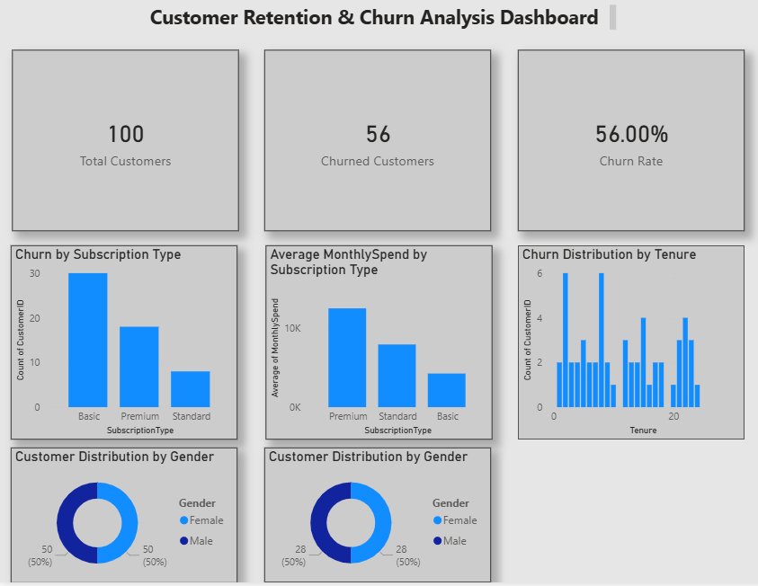

# 📊 Customer Churn Analysis Dashboard

## 📌 Overview
This project analyzes customer data to identify churn patterns and understand customer behavior. The goal is to provide actionable insights that help improve customer retention and reduce churn.

## 🛠 Tools Used
- Power BI
- Excel / CSV Dataset

## 📊 Key Analysis
- Churn rate calculation
- Customer segmentation based on subscription type
- Tenure analysis (customer lifespan)
- Monthly spend vs churn comparison

## 📈 Key Insights
- Customers with low tenure (1–3 months) have the highest churn rate  
- Basic subscription users churn more compared to Premium users  
- Customers with higher monthly spend tend to stay longer  
- Early-stage customers are more likely to leave, indicating onboarding gaps  

## 📁 Project Files
- customer_churn_dataset.csv – Dataset used for analysis  
- Power BI Dashboard – Visual insights and reporting  

## 📊 Dashboard Preview

## 🚀 Outcome
This project demonstrates the ability to analyze customer data, identify churn drivers, and generate insights that support business strategies for improving retention.
